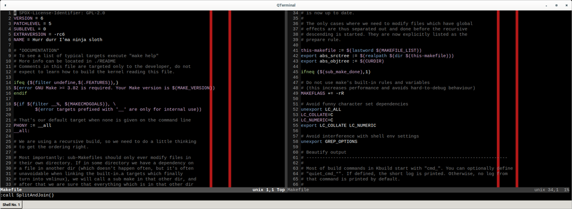
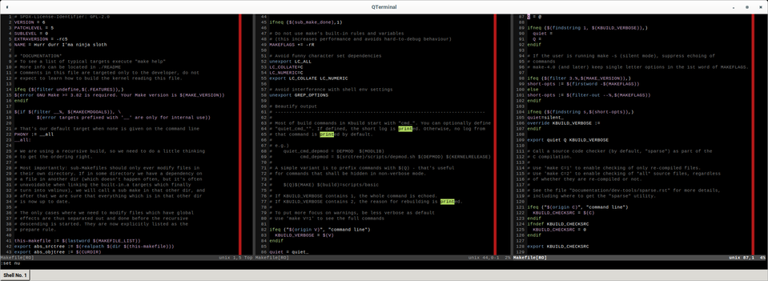

> Vim has the excellent feature to split the window to multiple panes, but can it
> open one file in two vertical tabs and let the contents of left pane continue
> in the one next to it?

From

<table>
<tr><td width="400px">1 ...</td></tr>
<tr><td>2 ...</td></tr>
<tr><td>3 ...</td></tr>
<tr><td>4 ...</td></tr>
<tr><td>5 ...</td></tr>
<tr><td>6 ...</td></tr>
</table>

to

<table>
<tr><td width="195px">1 ...</td><td width="195px">7 ...</td></tr>
<tr><td>2 ...</td><td>8 ...</td></tr>
<tr><td>3 ...</td><td>9 ...</td></tr>
<tr><td>4 ...</td><td>10 ...</td></tr>
<tr><td>5 ...</td><td>11 ...</td></tr>
<tr><td>6 ...</td><td>12 ...</td></tr>
</table>

Not by default, certainly with some scripting or by a set of a few commands
entered manually. We also want to preserve the line continuation while
scrolling. Maybe all of that is implemented somewhere for vim, I don't know.
First time I saw this was many years ago in computer lab, somebody using *emacs*.
What I'm going show dates back to 2011, it works and I think there must be an
easier way or some vim fork can do it natively.

The idea is to split the panel, move the lines by the screen height and enable
scrollbind.

```vim
function SplitAndJoin()
	:vsplit
	:wincmd l
	:normal L
	:normal z+
	:wincmd h
	:windo set scrollbind
	:wincmd h
endfunction
```

Moving the lines is really emulated by navigating to the bottom, resetting the
position so the next line is the first one displayed. This is obviously not
resistant to resizing the terminal, the line offset between the windows is
fixed. This can be manually adjusted by disabling scrollbind, syncing the lines
and enabling scrollbind again. I think I never needed that so urgently to
implement it, reopening the buffer is faster.

The function can be invoked from command line mode by

```vim
:call SplitAndJoin()
```

[](splitandjoin2.png)

# ... or 3 panes, lines continued

If we can do 2 panes by a few simple commands, we can do more, any number of
splits that still fit the screen. This repeats the split and bind step from
the last opened pane before moving back to the first one. The scrollbind is
temporarily disabled when moving the lines for the split.

```vim
function SplitAndJoin3()
	:vsplit
	:wincmd l
	:normal L
	:windo set noscrollbind
	:normal z+
	:wincmd h
	:windo set scrollbind
	:vsplit
	:wincmd l
	:normal L
	:windo set noscrollbind
	:normal z+
	:wincmd h
	:windo set scrollbind
	:wincmd h
	:wincmd h
endfunction
```

Which can look like this:

[](splitandjoin3.png)


# Problems

- resize - the line offsets are fixed from the time the window is split,
  resizing terminal window will get that out of sync
- randomly not refreshed - sometimes the right pane does not show the right
  lines, but Ctrl-L fixes that, so it's just a visual glitch
- unsynced text during and after typing - when writing new lines to the left
  pane, the right pane shifts only the line numbers, not the text itself, ESC
  and Ctrl-L does not fix it, only scrolling gets it back in sync with visual
  appearance
- wrap - with `set wrap on` and some lines actually wrapped in the left pane,
  the line offset is derived from that and once the wrapped line(s) scroll away
  from the screen the lines and text get out of sync
- switching files in the right pane will inherit the scrollbind, so movement
  will also apply to the left window (not desired e.g. when using tags/cscope/...)

That's not a short list, might be a bug somewhere like a missing refresh
after an action or it's working as expected individually but not when
combined like that. A native support in `vim` is needed. But, it is still
usable to some extent.
